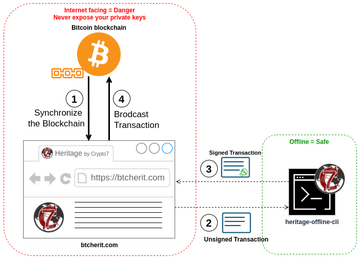

<div id="top"></div>


<!-- PROJECT SHIELDS -->
<!--
*** I'm using markdown "reference style" links for readability.
*** Reference links are enclosed in brackets [ ] instead of parentheses ( ).
*** See the bottom of this document for the declaration of the reference variables
*** for contributors-url, forks-url, etc. This is an optional, concise syntax you may use.
*** https://www.markdownguide.org/basic-syntax/#reference-style-links
-->
[![Contributors][contributors-shield]][contributors-url]
[![Forks][forks-shield]][forks-url]
[![Stargazers][stars-shield]][stars-url]
[![Issues][issues-shield]][issues-url]
[![MIT License][license-shield]][license-url]


<!-- PROJECT LOGO -->
<br />
<div align="center">
  <a href="https://github.com/crypto7world/heritage-offline-cli">
    
  </a>

  <h3 align="center">Heritage Offline CLI</h3>

  <p align="center">
    A Rust CLI tool intended to manage the Heritage wallet service private keys on an air gapped computer.
    <br />
    <a href="https://btcherit.com"><strong>Explore the Heritage wallet service »</strong></a>
    <br />
    <a href="https://github.com/crypto7world/heritage-offline-cli/issues">Report Bug</a>
  </p>
</div>

<!-- TABLE OF CONTENTS -->
<details>
  <summary>Table of Contents</summary>
  <ol>
    <li><a href="#about-the-project">About The Project</a></li>
    <li>
      <a href="#installation">Installation</a>
      <ul>
        <li><a href="#from-source">From source</a></li>
      </ul>
    </li>
    <li>
      <a href="#usage">Usage</a>
      <ul>
        <li><a href="#create-a-new-wallet">Create a new wallet</a></li>
        <li><a href="#restore-a-wallet-from-seed">Restore a wallet from seed</a></li>
        <li><a href="#extract-extended-public-keys">Extract eXtended public keys</a></li>
        <li><a href="#retrieve-heir-public-key">Retrieve heir public key</a></li>
        <li><a href="#spending-coins">Spending coins</a></li>
      </ul>
    </li>
    <li><a href="#roadmap">Roadmap</a></li>
    <li><a href="#built-with">Built With</a></li>
    <li><a href="#minimum-supported-rust-version-msrv">Minimum Supported Rust Version (MSRV)</a></li>
    <li><a href="#license">License</a></li>
    <li><a href="#contact">Contact</a></li>
    <li><a href="#acknowledgments">Acknowledgments</a></li>
  </ol>
</details>

<!-- ABOUT THE PROJECT -->
## About The Project
The [`heritage-offline-cli`] project provides a CLI tool to manages Bitcoin wallets private keys. As its name suggest, this CLI does not embbed any online capabilities and thus is not capable to synchronize itself with the Bitcoin blockchain.

It is intended for use in tandem with the [btcherit.com][heritage-wallet-service] service, which provides online capabilities such as wallet configuration, synchronization, balance display and transaction crafting (but has no signing capabilities).

Here is the basic workflow between the **Bitcoin blockchain**, the [btcherit.com][heritage-wallet-service] service and the [`heritage-offline-cli`]:
<div align="center">
    
    <p><i>This PNG can be edited using <a href="https://draw.io">Draw.io</a></i></p>
</div>

1. The [btcherit.com][heritage-wallet-service] service synchronize permanently with the Bitcoin blockchain;
2. From the service, you can see and manage your wallet, and create new *unsigned transactions*;
3. You sign those transactions using your private key(s) managed by the [`heritage-offline-cli`];
4. From the service, you can broadcast the *signed transactions*.

By installing the [`heritage-offline-cli`] on an air-gapped computer you will have one of the most secure setup you can imagine for a cold wallet because your private keys never need to "touch" the Internet.

Another advantage of this setup is that you only have to verify/trust the [`heritage-offline-cli`]: the [btcherit.com][heritage-wallet-service] service does not know your private keys and cannot steal your coin!

### Yeah, but I don't want to depend on an online service at all...
And I understand! Be patient, and take a look at the roadmap: before the year is over, a new CLI will be available in the [`btc-heritage`] project.

This new CLI will cover the usecase of the [`heritage-offline-cli`] and also provide synchronization capabilities with a Bitcoin node that you own, making it possible to manage your Heritage wallet entirely on your own!

### What is the added value of the service, once the new CLI can fully operate on its own?
Using Taproot Bitcoin scripts to manage inheritance is only good as long as you don't forget the move your coins to "reset" the dead-man switch. The service is here to remind you of that, as well as making the operation easy or even seemless (for example, if you spend coins few months before the expiration of your deadman switch, the service will automatically use this transaction to "reset" it).

On the other hand if you are dead, the service will notify and help your heirs to retrieve the coins you left behind.

Of course you can take steps to do all that on your own, the service is simply here to ease the burden.

<p align="right">(<a href="#top">back to top</a>)</p>

<!-- INSTALLATION -->
## Installation

### From source
To install a dev version of `heritage-offline-cli` from sources, make sure you have Rust installed. You can use any method, just make sure to have the Minimum Supported Rust Version. Using [rustup.rs](https://rustup.rs/) is generally a winner:
```shell
curl --proto '=https' --tlsv1.2 -sSf https://sh.rustup.rs | sh
```

Then clone this repo, `cd` into it and run cargo install:

```shell
git clone https://github.com/crypto7world/heritage-offline-cli
cd heritage-offline-cli
cargo install --path .
export PATH="$PATH:$HOME/.cargo/bin" # Make sure cargo installation path is in your PATH
heritage-offline-cli # to verify it worked, should display usage instructions
```

Alternatively you can just use `cargo build` and then copy the `heritage-offline-cli` binary from the `target` directory to wherever you like.

<p align="right">(<a href="#top">back to top</a>)</p>

<!-- USAGE -->
## Usage

You can get help simply by running 
```shell
heritage-offline-cli help
```

Or, to get help about a specific command `heritage-offline-cli help <command>`, for example:
```shell
heritage-offline-cli help generate
```
```
Generate a new wallet

Usage: heritage-offline-cli generate [OPTIONS]

Options:
  -w, --wallet-name <WALLET_NAME>  The name of the wallet to use [default: default_wallet]
      --with-passphrase            Signals that the wallet is protected by a passphrase that will be prompted for
  -c, --word-count <WORD_COUNT>    The number of words in the mnemonic [default: 12] [possible values: 12, 15, 18, 21, 24]
  -e, --entropy <ENTROPY>          Use the given entropy instead of the local PRNG. The given entropy must 
                                   be encoded in hexadecimal, its length between 128 and 256 bits and a 
                                   multiple of 32bits, depending on the configured number of words
  -h, --help                       Print help
```

### Create a new wallet
Create a new *default_wallet* by simply running:
```shell
heritage-offline-cli generate
```

You can also create wallets with other names, set a passphrase, use `ENTROPY` from an external source or parameter the length of the wallet mnemonic. See:
```shell
heritage-offline-cli help generate
```

### Restore a wallet from seed
If you already have a mnemonic you would like to restore, for example `abandon abandon abandon abandon abandon abandon abandon abandon abandon abandon abandon about`:
```shell
heritage-offline-cli restore abandon abandon abandon abandon abandon abandon abandon abandon abandon abandon abandon about
```
<span style="color:red">**⚠ OBVIOUSLY DO NOT USE *THAT* MNEMONIC TO GENERATE YOUR BITCOIN WALLET ⚠**</span>

You can also restore wallets with other names or using a passphrase. See:
```shell
heritage-offline-cli help restore
```

### Extract eXtended public keys
In order to generate addresses and synchronize from the Bitcoin blockchain on its own, the [btcherit.com][heritage-wallet-service] service needs eXtended public keys (XPub). You can see an XPub as an "address generator" that will always generate addresses that you can spend from (refer to [BIP32](https://github.com/bitcoin/bips/blob/master/bip-0032.mediawiki) if you wish to understand exactly how that works).

The [btcherit.com][heritage-wallet-service] service will typically consume one XPub each time you "reset" your dead-man switch. Therefore, your best option is to provide it from the beginning with 20 XPubs, and forget about that for the next 20 years.

You can display the first 20 XPubs of your wallet:
```shell
heritage-offline-cli get-xpubs
```

Or you can display the first 40:
```shell
heritage-offline-cli get-xpubs -c 40
```

### Retrieve heir public key
Maybe you have a friend or a relative who want to put *YOU* in *HIS* Heritage configuration. You will need to give him a public key:
```shell
heritage-offline-cli get-heir-pubkey
```
By default, the address given to you is taken at the address derivation index 0. You can also retrieve other public keys at any other address using `-i`, for example:
```shell
heritage-offline-cli get-heir-pubkey -i 12
```

#### Nota
You may notice that the derivation path for "Heir pub keys" always uses the hardened accout 1751476594. This *magic number* was chosen because:
1. Ideally we want your "Heir pub keys" to stay unused until you inherit, so it must be derived from an account you will not normally use in your wallet;
2. The word "heir" in Hexadecimal ASCII is 0x68656972, which in decimal translates to 1751476594.

At it is an account number you will never use in any conceivable usecase, it was chosen and hardcoded in the CLI. If you really wants to use something else, you can change the code at [src/handlers.rs:575](./src/handlers.rs).

### Spending coins
As a reminder, here is the workflow for spending coins using the [btcherit.com][heritage-wallet-service] service and the [`heritage-offline-cli`]:
<div align="center">
    
    <p><i>This PNG can be edited using <a href="https://draw.io">Draw.io</a></i></p>
</div>

You spend coins by creating a transaction: you designate the recipients of your transaction and the amounts they will receive. Then the [btcherit.com][heritage-wallet-service] service will provide you with an *unsigned transaction*. In Bitcoin terminology, we call that a *Partially Signed Bitcoin Transaction*, or **PSBT** for short.

#### Display a PSBT
As you may not want to blindly trust the [btcherit.com][heritage-wallet-service] service (or the transit over the Internet), you can use the CLI to display the PSBT (your *unsigned transaction*) before signing it.

You can do that simply by copy/pasting the PSBT as provided by the service into this CLI command:
```shell
heritage-offline-cli display-psbt <BASE64 encoded PSBT>
```
Doing so will allow you to verify that amounts and addresses are what you expect, i.e. what you asked for in the [btcherit.com][heritage-wallet-service] service UI.

#### Sign a PSBT
Once confortable with the PSBT, you can sign it:
```shell
heritage-offline-cli sign <BASE64 encoded PSBT>
```

Or, if you are not using the *default_wallet*:
```shell
heritage-offline-cli sign -w <wallet_name> <BASE64 encoded PSBT>
```

The CLI will then output the *signed transaction*, still in PSBT format (it will look the same because nothing resemble a base64 string more than another base64 string, but its different 😉). You can copy/paste the resulting transaction back in the [btcherit.com][heritage-wallet-service] to broadcast it.

<p align="right">(<a href="#top">back to top</a>)</p>

<!-- ROADMAP -->
## Roadmap

The [`heritage-offline-cli`] project is destined to be archived. It is a focused, basic CLI narrowed to manage only private keys for an **Heritage wallet** (it was in fact the first piece of code I wrote for the whole **Heritage wallet** project as a 2-months old, new-born Rustacean at the time). Rather than building upon this CLI, my goal is rather to expand on the main [`btc-heritage`] project.

Currently, [`btc-heritage`] only contains the core crate fueling the [btcherit.com][heritage-wallet-service] service that provide the public-facing part of the **Heritage wallet**. The crate provides all the logic allowing to manage the Heritage wallet configuration and translate them into Taproot addresses. I will add another library for private/signing operations (providing the fonctionalities currently supported by [`heritage-offline-cli`]) and a **brand new CLI** allowing both public and private operations, usage of your own Bictoin node and supporting the split-wallet scenario. When I reach that goal, before the end of 2024, the [`heritage-offline-cli`] repository will have no reason to exist anymore, as the new CLI will cover all its use-cases and more.

Of course, this repository will stay available as a public archive and you will be able to continue using it if you wish, but it will not receive additionnal support/updates.

<p align="right">(<a href="#top">back to top</a>)</p>

## Built With

[![Rust][rust-shield]][rust-url]

And based upon 3 Rust projects without which I would not have gotten that far:

* [`bdk`]
* [`rust-miniscript`]
* [`rust-bitcoin`]

Thanks.

<p align="right">(<a href="#top">back to top</a>)</p>

<!-- MSRV -->
## Minimum Supported Rust Version (MSRV)
This binary compile with Rust 1.74.1.

<p align="right">(<a href="#top">back to top</a>)</p>

<!-- LICENSE -->
## License

Distributed under the MIT License. See [`LICENSE`][license-url] for more information.

<p align="right">(<a href="#top">back to top</a>)</p>

<!-- CONTACT -->
## Contact

John Galt - [@Crypto7W](https://twitter.com/Crypto7W) - john@crypto7.world

Though my real name is Jérémie Rodon ([LinkedIn][jr-linkedin-url], [GitHub][jr-github-url]), I operate this project under the pseudonym John Galt in reference to the character of *Ayn Rand* novel [**Atlas Shrugged**](https://www.amazon.com/Atlas-Shrugged-Ayn-Rand-ebook/dp/B003V8B5XO) (and, yes, I obviously embrace John Galt philosophy).

Project Link: [https://github.com/crypto7world/heritage-offline-cli][repo-url]

<p align="right">(<a href="#top">back to top</a>)</p>

<!-- ACKNOWLEDGMENTS -->
## Acknowledgments

* [`rust-miniscript`]
* [`rust-bitcoin`]
* [`bdk`]
* [Best Readme Template](https://github.com/othneildrew/Best-README-Template)
* [Img Shields](https://shields.io)

<p align="right">(<a href="#top">back to top</a>)</p>


<!-- MARKDOWN LINKS & IMAGES -->
<!-- https://www.markdownguide.org/basic-syntax/#reference-style-links -->
[heritage-wallet-service]: https://btcherit.com
[repo-url]: https://github.com/crypto7world/heritage-offline-cli
[`heritage-offline-cli`]: https://github.com/crypto7world/heritage-offline-cli
[`btc-heritage`]: https://github.com/crypto7world/btc-heritage
[contributors-shield]: https://img.shields.io/github/contributors/crypto7world/heritage-offline-cli.svg?style=for-the-badge
[contributors-url]: https://github.com/crypto7world/heritage-offline-cli/graphs/contributors
[forks-shield]: https://img.shields.io/github/forks/crypto7world/heritage-offline-cli.svg?style=for-the-badge
[forks-url]: https://github.com/crypto7world/heritage-offline-cli/network/members
[stars-shield]: https://img.shields.io/github/stars/crypto7world/heritage-offline-cli.svg?style=for-the-badge
[stars-url]: https://github.com/crypto7world/heritage-offline-cli/stargazers
[issues-shield]: https://img.shields.io/github/issues/crypto7world/heritage-offline-cli.svg?style=for-the-badge
[issues-url]: https://github.com/crypto7world/heritage-offline-cli/issues
[license-shield]: https://img.shields.io/github/license/crypto7world/heritage-offline-cli.svg?style=for-the-badge
[license-url]: https://github.com/crypto7world/heritage-offline-cli/blob/master/LICENSE
[jr-linkedin-url]: https://linkedin.com/in/JeremieRodon
[jr-github-url]: https://github.com/JeremieRodon
[rust-shield]: https://img.shields.io/badge/Rust-000000?style=for-the-badge&logo=rust&logoColor=white
[rust-url]: https://https://www.rust-lang.org/ 
[`rust-miniscript`]: https://github.com/rust-bitcoin/rust-miniscript
[`rust-bitcoin`]: https://github.com/rust-bitcoin/rust-bitcoin
[`bdk`]: https://github.com/bitcoindevkit/bdk